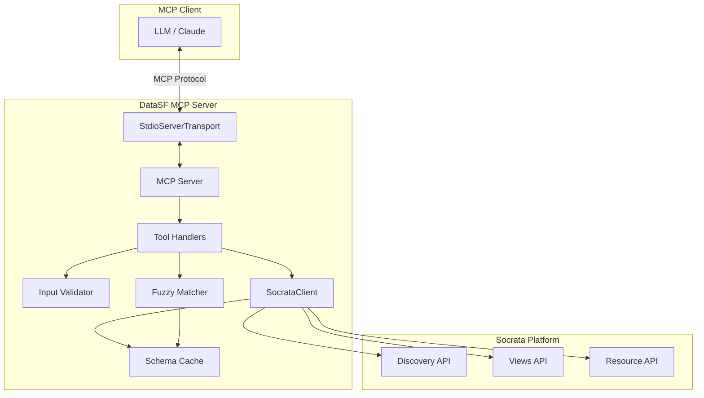

# Design Document: DataSF MCP Server

## Overview

The DataSF MCP Server is a Node.js/TypeScript application that implements the Model Context Protocol to provide LLMs with access to San Francisco's open data portal. The server exposes three primary tools: dataset search, schema retrieval, and SoQL query execution. It communicates with the Socrata platform APIs and includes features like schema caching, column name auto-correction via fuzzy matching, and comprehensive error handling.

## Architecture



### Data Flow

1. LLM sends tool call via MCP protocol over stdio
2. Server validates input using Zod schemas
3. Tool handler processes request:
   - For search: calls Discovery API
   - For schema: checks cache, then calls Views API
   - For query: optionally auto-corrects columns, then calls Resource API
4. Response formatted as MCP content and returned to LLM

## Components and Interfaces

### 1. SocrataClient (`socrataClient.ts`)

Handles all HTTP communication with Socrata APIs.

```typescript
interface DatasetSearchResult {
  id: string;        // 4x4 ID
  name: string;      // Dataset name
  description: string;
}

interface ColumnInfo {
  name: string;      // Human-readable name
  fieldName: string; // API field name for SoQL
  dataType: string;  // Data type (text, number, calendar_date, etc.)
}

interface SchemaResult {
  columns: ColumnInfo[];
  datasetName: string;
  rowCount: number;
}

class SocrataClient {
  constructor();
  
  searchDatasets(query: string, limit?: number): Promise<DatasetSearchResult[]>;
  listDatasets(category?: string, limit?: number): Promise<DatasetSearchResult[]>;
  getSchema(datasetId: string): Promise<SchemaResult>;
  queryResource(datasetId: string, soql: string): Promise<unknown[]>;
}
```

**API Endpoints:**
- Discovery API: `https://api.us.socrata.com/api/catalog/v1`
- Views API: `https://data.sfgov.org/api/views/{datasetId}.json`
- Resource API: `https://data.sfgov.org/resource/{datasetId}.json`

### 2. SchemaCache (`cache.ts`)

In-memory cache for dataset schemas to reduce API calls.

```typescript
interface CacheEntry {
  schema: SchemaResult;
  timestamp: number;
}

class SchemaCache {
  private cache: Map<string, CacheEntry>;
  private ttlMs: number; // Default: 5 minutes
  
  get(datasetId: string): SchemaResult | null;
  set(datasetId: string, schema: SchemaResult): void;
  has(datasetId: string): boolean;
  clear(): void;
}
```

### 3. FuzzyMatcher (`fuzzyMatcher.ts`)

Provides column name auto-correction using Fuse.js.

```typescript
interface CorrectionResult {
  original: string;
  corrected: string;
  wasChanged: boolean;
}

class FuzzyMatcher {
  constructor(threshold?: number); // Default: 0.4
  
  correctColumns(userFields: string[], validFields: string[]): CorrectionResult[];
  correctSoqlQuery(soql: string, validFields: string[]): {
    correctedQuery: string;
    corrections: CorrectionResult[];
  };
}
```

### 4. InputValidator (`validator.ts`)

Validates all inputs using Zod schemas.

```typescript
const DatasetIdSchema = z.string().regex(/^[a-z0-9]{4}-[a-z0-9]{4}$/);
const SearchQuerySchema = z.string().min(1).max(500);
const SoqlQuerySchema = z.string().min(1).max(4000);

function validateDatasetId(id: string): { valid: boolean; error?: string };
function validateSearchQuery(query: string): { valid: boolean; error?: string };
function validateSoqlQuery(soql: string): { valid: boolean; error?: string };
```

### 5. MCP Server (`index.ts`)

Main entry point that wires everything together.

```typescript
// Tool definitions
const tools = [
  {
    name: "search_datasf",
    description: "Search for public datasets in San Francisco's open data portal",
    inputSchema: { query: string, limit?: number }
  },
  {
    name: "list_datasf",
    description: "Browse available datasets, optionally filtered by category",
    inputSchema: { category?: string, limit?: number }
  },
  {
    name: "get_schema",
    description: "Get the schema (columns and types) for a dataset. Call this before writing queries.",
    inputSchema: { dataset_id: string }
  },
  {
    name: "query_datasf",
    description: "Execute a SoQL query against a dataset",
    inputSchema: { dataset_id: string, soql: string, auto_correct?: boolean }
  }
];
```

## Data Models

### Tool Input Schemas

```typescript
// search_datasf
interface SearchInput {
  query: string;  // Keywords to search for
  limit?: number; // Max results (default: 5, max: 20)
}

// get_schema
interface GetSchemaInput {
  dataset_id: string; // 4x4 ID matching /^[a-z0-9]{4}-[a-z0-9]{4}$/
}

// query_datasf
interface QueryInput {
  dataset_id: string;    // 4x4 ID
  soql: string;          // SoQL query string
  auto_correct?: boolean; // Enable column name correction (default: true)
}
```

### Response Formats

```typescript
// Search response
interface SearchResponse {
  results: DatasetSearchResult[];
  count: number;
  message?: string; // "No results found" when empty
}

// Schema response
interface SchemaResponse {
  dataset_id: string;
  dataset_name: string;
  columns: ColumnInfo[];
  row_count: number;
  cached: boolean;
}

// Query response
interface QueryResponse {
  data: unknown[];
  count: number;
  truncated: boolean;
  corrections?: CorrectionResult[]; // Present if auto-correction was applied
}

// Error response
interface ErrorResponse {
  error: string;
  error_type: "validation" | "not_found" | "rate_limit" | "timeout" | "api_error";
  details?: string;
}
```


## Correctness Properties

*A property is a characteristic or behavior that should hold true across all valid executions of a system-essentially, a formal statement about what the system should do. Properties serve as the bridge between human-readable specifications and machine-verifiable correctness guarantees.*

### Property 1: Search results contain required fields
*For any* search query that returns results, each result object SHALL contain non-null `id`, `name`, and `description` fields.
**Validates: Requirements 1.1**

### Property 2: Search results respect configured limit
*For any* search operation with a specified limit, the number of returned results SHALL be less than or equal to that limit.
**Validates: Requirements 1.2**

### Property 3: Schema response contains complete column information
*For any* valid dataset ID that exists, the schema response SHALL contain columns where each column has non-empty `name`, `fieldName`, and `dataType` fields.
**Validates: Requirements 2.1**

### Property 4: Invalid 4x4 IDs are rejected by validation
*For any* string that does not match the pattern `^[a-z0-9]{4}-[a-z0-9]{4}$`, the dataset ID validator SHALL return invalid with an error message.
**Validates: Requirements 2.2, 7.1**

### Property 5: Schema caching preserves data
*For any* dataset ID, after successfully retrieving its schema, subsequent cache lookups SHALL return an equivalent schema object.
**Validates: Requirements 2.4**

### Property 6: Query results are valid JSON arrays
*For any* successful query execution, the returned data SHALL be an array where each element is a valid JSON object.
**Validates: Requirements 3.1**

### Property 7: Large results are truncated with indicator
*For any* query result set exceeding the maximum size, the response SHALL have `truncated` set to true and the data array length SHALL equal the maximum allowed size.
**Validates: Requirements 3.3**

### Property 8: Fuzzy matching corrects close matches
*For any* input field name within the fuzzy threshold distance of exactly one valid field name, the corrected output SHALL equal that valid field name.
**Validates: Requirements 4.1**

### Property 9: Corrections are reported in metadata
*For any* auto-correction operation where at least one field was changed, the corrections array SHALL be non-empty and contain entries for all changed fields.
**Validates: Requirements 4.2, 4.4**

### Property 10: Non-matching fields pass through unchanged
*For any* input field name that has no valid field within the fuzzy threshold, the output SHALL equal the original input unchanged.
**Validates: Requirements 4.3**

### Property 11: App Token included in headers when configured
*For any* API request made when SOCRATA_APP_TOKEN is set, the request headers SHALL include `X-App-Token` with the configured value.
**Validates: Requirements 5.1**

### Property 12: App Token never exposed in responses
*For any* response returned to the LLM, the serialized response text SHALL NOT contain the App Token string.
**Validates: Requirements 5.4**

### Property 13: MCP responses have correct content format
*For any* tool response, the content SHALL be an array containing at least one object with `type` and `text` fields.
**Validates: Requirements 6.3**

### Property 14: Search query length validation
*For any* search query string, validation SHALL fail if the string is empty OR if the string length exceeds 500 characters.
**Validates: Requirements 7.2**

### Property 15: SoQL query length validation
*For any* SoQL query string, validation SHALL fail if the string is empty OR if the string length exceeds 4000 characters.
**Validates: Requirements 7.3**

### Property 16: Validation errors are descriptive
*For any* validation failure, the error message SHALL contain the name of the field that failed validation.
**Validates: Requirements 7.4**

## Error Handling

### Error Types and HTTP Status Mapping

| Error Type | HTTP Status | Description | User Message |
|------------|-------------|-------------|--------------|
| `validation` | N/A (pre-request) | Input failed Zod validation | "Invalid {field}: {reason}" |
| `not_found` | 404 | Dataset ID doesn't exist | "Dataset {id} not found" |
| `rate_limit` | 429 | Socrata rate limiting | "Rate limited. Try again later." |
| `timeout` | N/A (axios timeout) | Request exceeded timeout | "Request timed out after {n}s" |
| `api_error` | 4xx/5xx | Other Socrata errors | Pass through Socrata message |

### Error Handling Strategy

1. **Validation errors**: Caught before any API call, return immediately with descriptive message
2. **Network errors**: Wrap axios calls in try/catch, classify by error type
3. **API errors**: Parse Socrata error response, extract message field, return to LLM for self-correction
4. **Timeout errors**: Configure axios timeout, catch ECONNABORTED errors

```typescript
async function handleApiCall<T>(fn: () => Promise<T>): Promise<T | ErrorResponse> {
  try {
    return await fn();
  } catch (error) {
    if (axios.isAxiosError(error)) {
      if (error.code === 'ECONNABORTED') {
        return { error: 'Request timed out', error_type: 'timeout' };
      }
      if (error.response?.status === 404) {
        return { error: 'Dataset not found', error_type: 'not_found' };
      }
      if (error.response?.status === 429) {
        return { error: 'Rate limited', error_type: 'rate_limit' };
      }
      return { 
        error: error.response?.data?.message || error.message,
        error_type: 'api_error'
      };
    }
    throw error;
  }
}
```

## Testing Strategy

### Property-Based Testing Library

**Library**: `fast-check` - A TypeScript-native property-based testing library with excellent type inference and generator composition.

### Test Organization

```
/src
  /__tests__
    /unit
      validator.test.ts      # Input validation tests
      fuzzyMatcher.test.ts   # Fuzzy matching tests
      cache.test.ts          # Schema cache tests
    /property
      validator.property.ts  # Property tests for validation (Props 4, 14, 15, 16)
      fuzzyMatcher.property.ts # Property tests for fuzzy matching (Props 8, 9, 10)
      cache.property.ts      # Property tests for caching (Prop 5)
      responses.property.ts  # Property tests for response format (Props 1, 2, 3, 6, 7, 13)
      security.property.ts   # Property tests for token handling (Props 11, 12)
    /integration
      socrataClient.test.ts  # Integration tests with real API (limited)
```

### Property Test Configuration

Each property-based test will:
- Run a minimum of 100 iterations
- Use seed-based reproducibility for debugging failures
- Include explicit property reference comments

```typescript
// Example property test structure
import fc from 'fast-check';

describe('Validator Properties', () => {
  // **Feature: datasf-mcp-server, Property 4: Invalid 4x4 IDs are rejected by validation**
  it('rejects strings not matching 4x4 pattern', () => {
    fc.assert(
      fc.property(
        fc.string().filter(s => !/^[a-z0-9]{4}-[a-z0-9]{4}$/.test(s)),
        (invalidId) => {
          const result = validateDatasetId(invalidId);
          return result.valid === false && result.error !== undefined;
        }
      ),
      { numRuns: 100 }
    );
  });
});
```

### Unit Test Coverage

Unit tests will cover:
- Specific examples demonstrating correct behavior
- Edge cases (empty inputs, boundary values)
- Error conditions and error message content
- Integration points between components

### Test Generators

Custom generators for property tests:

```typescript
// Valid 4x4 ID generator
const valid4x4Id = fc.tuple(
  fc.stringOf(fc.constantFrom(...'abcdefghijklmnopqrstuvwxyz0123456789'.split('')), { minLength: 4, maxLength: 4 }),
  fc.stringOf(fc.constantFrom(...'abcdefghijklmnopqrstuvwxyz0123456789'.split('')), { minLength: 4, maxLength: 4 })
).map(([a, b]) => `${a}-${b}`);

// Column info generator
const columnInfo = fc.record({
  name: fc.string({ minLength: 1 }),
  fieldName: fc.string({ minLength: 1 }).map(s => s.toLowerCase().replace(/\s/g, '_')),
  dataType: fc.constantFrom('text', 'number', 'calendar_date', 'checkbox', 'url')
});

// Search result generator
const searchResult = fc.record({
  id: valid4x4Id,
  name: fc.string({ minLength: 1 }),
  description: fc.string()
});
```
